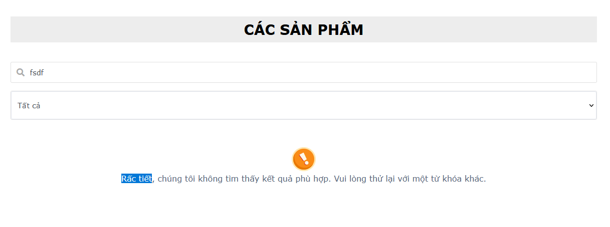

Route của các lỗi

# Lỗi chức năng: chức năng hoạt động không như mong đợi trong
/product
Khi tìm kiếm "Cà phê" nhưng kết quả nhận được lại bao gồm cả "Cam tươi"

# Lỗi giao diện ( ví dụ textbox che chữ, element không đều)
/
Ở giao diện trang chủ hiển thị các sản phẩm mới nhất element không đồng đều

# Lỗi chính tả
/product

# Liên kết page not found
/
truy cập trang chủ nhưng không tìm thấy
ẩn route>web.php là xong (tuỳ chọn)

# Lỗi Crash
http://coffe_lar_testing.test/cart
## redirect-loop
Người dùng sẽ bị điều hướng tới trang thao tác trước khi truy cập vào cart
Lỗi xảy ra khi người dùng có sản phẩm trong giỏ hàng, truy cập trang giỏ hàng, xoá tất cả sản phẩm trong giỏ hàng và 
truy cập đường dẫn  
http://coffe_lar_testing.test/cart
thì sẽ bị crash do bị vòng lặp điều hướng vì trang người dùng thao tác trước đó là trang giỏ hàng.
Hình dưới minh hoạ

# Lỗi field validation, nhập sai yêu cầu (bắt buộc có chữ cái, nhưng thiếu không báo lỗi, hoặc trường số mà cho phép nhập chữ..)
/profile
Tên người dùng mà cho phép những kí tự đặc biệt

